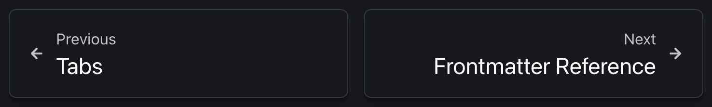

This site uses [Astro Starlight](https://starlight.astro.build/). It's nice! Here are a few notes about it.

## Implicit Sections in the Table of Contents

Each page will get a table of contents (TOC). That's super nice! But there are some quirks around implicit sections.

### The Overview Section

The table of contents for each page will have "Overview" as the first h2 level heading, regardless of if you have `## Overview` in your markdown anywhere.

This means if you start a doc like this:

```markdown
Lorem ipsum dolor sit amet, consectetur adipiscing elit. Etiam massa nisi,
congue vel scelerisque in, pretium ac sem. In tincidunt velit et venenatis
aliquam. Vivamus blandit nisl ex.

## Overview

Pellentesque tincidunt sodales lectus. Nullam ut nunc luctus, varius ipsum nec,
auctor velit. Nullam rhoncus feugiat dapibus. Vivamus vel lobortis nunc. In quis
gravida velit, et fringilla elit. Integer faucibus suscipit mauris, nec porta
ipsum dignissim non. Donec lacinia sed ligula quis congue.

## Next Section

Nunc risus sapien, scelerisque eu tellus eget, molestie vehicula orci. Sed
rutrum lorem sit amet ornare pellentesque. Praesent sollicitudin semper odio id
pharetra. Curabitur sit amet euismod tellus, vitae suscipit neque. Vestibulum
finibus id leo in congue. Sed ornare a elit quis viverra. Vivamus hendrerit
purus sit amet molestie maximus. Nulla at augue mauris.
```

Then your table of contents will have two "Overview" sections at the start, and look something like this:

```
On this page

- Overview
- Overview
- Next Section
```

Something to keep in mind!

### The Footnotes Section

Starlight let's you use [footnotes](https://starlight.astro.build/guides/authoring-content/#footnotes) in your markdown documents. That's neat![^1] It even puts a nice little link in the footnote so you can jump back up to where you were when you clicked the footnote link.

Normally, I like to put an `h2` in the markdown file to separate the footnotes from the rest of the content. However, Starlight automatically puts a "Footnotes" entry into the table of contents for you. So, if you include your own `h2` like this:

```markdown
This is some great content[^1].

## Footnotes

[^1]: Yes, it is!
```

Then you will get two entries in the table of contents for footnotes.[^2]

### Can this be configured?

I don't think so, but I didn't do too much investigating on the matter. You can [configure the TOC](https://starlight.astro.build/reference/configuration/#tableofcontents) a bit though.

## Redirects

Astro let's you [configure redirects](https://docs.astro.build/en/guides/routing/#configured-redirects). I assume that means they will work in Starlight too.

I tried a small test:

```js
export default defineConfig({
  redirects: {
    "/something": "/uncategorized/starlight_notes",
  },
  // ... snip ...
});
```

But when navigating to `/something` it kept redirecting to `/uncategorized/starlight_notes.md`, rather than `/uncategorized/starlight_notes`. So it was redirecting to a page that gave a 404.

There is probably something fairly obvious that I'm missing here, but as I don't actually need this feature at the moment, I will leave it there for now.

## Pagination

By default, Starlight has pagination buttons in the page's footer. They look like this:



That's nice generally, but sometimes you may want to turn them off. Luckily, they are [configurable](https://starlight.astro.build/reference/configuration/#pagination).

E.g., in the `astro.config.mjs`:

```js
export default defineConfig({
  integrations: [
    starlight({
      // Turn of the pagination buttons in the footer
      pagination: false,
      // ... snip ...
    }),
  ],
});
```

---

[^1]: Footnotes are nice!

[^2]: The funny thing about this is, the first markdown document I put into Starlight had both Overview and Footnotes sections marked as `h2`, which made the table of contents start with "Overview Overview" and end with "Footnotes Footnotes".
